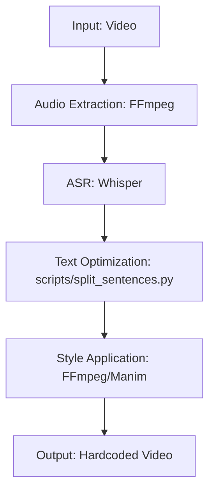

# Skill: Subtitle Generator (Persian Specialized)

Comprehensive technical protocol for producing professional Persian subtitles using a multi-phase pipeline involving AI transcription (Whisper), typographical optimization, and professional rendering (FFmpeg/Manim).

---

## 1. Subtitle Generation Pipeline
The standard workflow follows a 5-phase execution model.



### 1.1 Audio Extraction & Transcription
Standardized extraction for optimal Whisper performance.
```bash
# Extract high-quality audio
ffmpeg -i input.mp4 -q:a 0 -map a audio.wav

# Transcription with word-level timestamps
whisper audio.wav --model large-v3 --language fa --output_format json --word_timestamps True
```

---

## 2. Typographical Standards for Persian
Mandatory rules for visual clarity and cinematic quality.

| Rule | Parameter | Context |
| :--- | :--- | :--- |
| **Line Length** | Max 42 characters | Cinematic standard |
| **Duration** | 1.0s (min) to 7.0s (max) | Reading speed |
| **Gap** | 2 frames (min) | Subtitle separation |
| **Font** | B Nazanin, Vazir, IRANSans | Persian legibility |

---

## 3. Specialized Persian ASS Style
The ASS (Advanced Substation Alpha) format is the standard for stylized hardcoded subtitles.

```ini
[V4+ Styles]
Format: Name, Fontname, Fontsize, PrimaryColour, SecondaryColour, OutlineColour, BackColour, Bold, Italic, Underline, StrikeOut, ScaleX, ScaleY, Spacing, Angle, BorderStyle, Outline, Shadow, Alignment, MarginL, MarginR, MarginV, Encoding
Style: Default,B Nazanin,48,&H00FFFFFF,&H000000FF,&H00000000,&H64000000,0,0,0,0,100,100,0,0,1,2,1,2,20,20,30,1
```

### 3.1 Hardcoding Command
```bash
ffmpeg -i input.mp4 -vf "ass=subtitle.ass" -c:a copy output.mp4
```

---

## 4. Supporting Scripts

### 4.1 Sentence Splitting Protocol (`split_sentences.py`)
```python
import json
import sys

def split_subtitle(text, max_chars=42):
    """Splits text into lines while respecting Persian sentence boundaries."""
    words = text.split(' ')
    lines = []
    current_line = ""
    for word in words:
        if len(current_line) + len(word) + 1 <= max_chars:
            current_line += (" " + word if current_line else word)
        else:
            if current_line: lines.append(current_line)
            current_line = word
    if current_line: lines.append(current_line)
    return lines

# Usage: python split_sentences.py input.txt output.json
```

### 4.2 Whisper to ASS Converter (`apply_subtitle.py`)
```python
import json
import sys
from datetime import timedelta

def seconds_to_ass_time(seconds):
    td = timedelta(seconds=seconds)
    hours, minutes, secs = td.seconds // 3600, (td.seconds % 3600) // 60, td.seconds % 60
    centiseconds = int(td.microseconds / 10000)
    return f"{hours}:{minutes:02d}:{secs:02d}.{centiseconds:02d}"

# Usage: python apply_subtitle.py input.json output.ass
```

---

## 5. Best Practices & Cinematic Rules
- **The 1-7-2 Rule:** 1s min duration, 7s max duration, 2-frame gap between subtitles.
- **BiDi Support:** For mixed text (Persian/English), always wrap in Unicode control characters if Pango fails.
- **Manim Hint:** Use the `safe_persian_text` utility defined in `manim-animation.md` for rendering.

---
[Back to README](../../README.md)
