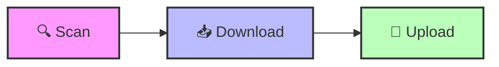

# 🚀 Telegram Video Automation Kit

[](https://www.linkedin.com/in/su6i/)

**Navigation:** [README](README.md) | [Quick Start](QUICK_START.md) | [Scan & Resume](SCAN_RESUME.md)

---

## 🏗️ 3-Step Automated Workflow



The system is designed to be fully automated. You only need to run three commands in sequence:

### 1. 🔍 Scan
Scrapes the target platform to identify all lessons and metadata.
```bash
./scan.sh
```

### 2. 📥 Download
Fetches the video files into the local `downloads/` directory.
```bash
./download.sh
```

### 3. 🚀 Upload
Optimizes, re-encodes, and uploads everything to Telegram.
```bash
./upload.sh --res 720 --intro
```
**CLI Options & Defaults:**
- `--res 720|1080`: Target video resolution. **Default: 720**.
- `--intro`: Adds a professional title card intro to each video. **Default: OFF**.

---

## 🤖 Smart Indexing Features
- **Placeholders**: If you are starting a new channel (uploading video 001), the script automatically sends 10 reserved messages at the start.
- **Auto-ToC**: After the upload batch finishes, the system automatically updates those 10 placeholders with a clickable Table of Contents and posts a final Index at the end of the channel.

## 📁 Project Structure
- `scripts/`: Implementation logic (Python).
- `src/`: Shared core modules.
- `.storage/`: Local cache, manifest, and history.
- `temp/`: Temporary processing directory.

---

## 🌟 Key Technical Highlights (For Recruiters)
This project demonstrates several advanced software engineering concepts:
- **Resilient Web Scraping**: Implements a modular scraping engine with session management and cookie persistence.
- **Multithreaded Processing**: Accelerated video downloads and processing using concurrent execution.
- **Automated Video Engineering**: Real-time re-encoding, resolution scaling, and dynamic title card generation using `FFmpeg`.
- **Telegram Bot Integration**: Complex API interaction for automated sequential uploads and real-time caption updates.
- **Clean Architecture**: Decoupled modules for scraping, processing, and communication.

---

**Next Steps:** Check the [Quick Start Guide](QUICK_START.md) for environment setup.
