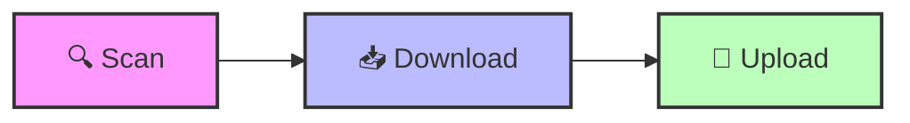

<div align="center">
  
  <h1>Telegram Video Automation Kit</h1>

  
  
  
  <a href="https://www.linkedin.com/in/su6i/">
    
  </a>
</div>


**Navigation:** [README](README.md) | [Quick Start](QUICK_START.md) | [Scan & Resume](SCAN_RESUME.md)

<div align="center">
  <a href="https://www.linkedin.com/in/su6i/">
    
  </a>
</div>

---

## ⚡ Quick Start
```bash
./scan.sh           # 🔍 Map structure
./download.sh       # 📥 Fetch media
./upload.sh         # 🚀 Optimize, Post & Auto-Index
```

> [!TIP]
> **Customizing the Index (Table of Contents)**
> If you have pre-created "Welcome" or "Placeholder" messages in your channel, you can tell the uploader to use them for the Table of Contents:
> `./upload.sh --index-offset 123` (Where `123` is the Message ID of your first placeholder).

---

## 🏗️ 3-Step Automated Workflow



The system is designed to be a fully automated bridge between web content and Telegram delivery.

### 🧩 Core Components
1. **🔍 Scan**: Initializes the mapping of content hierarchy and metadata via `scraper.py`.
   - Use `./scan.sh --update-metadata` to force-refresh all lesson descriptions and links from the website (useful if formatting or links have changed).
2. **📥 Download**: Asynchronously fetches media assets into the local environment.
3. **🚀 Upload**: A high-performance pipeline featuring:
   - ⚡ **Strict Resolution Control**: Automatically scales and pads videos to **720p (1280x720)** or 1080p, strictly preserving original aspect ratios.
   - 📝 **Structured Captioning**: Smart formatting of descriptions with bold headers (e.g., *Lesson Recap*) and list preservation.
   - 📄 **Automatic Overflow**: Descriptions exceeding 1024 characters are automatically split and continued as a reply message.
   - 🎬 **Smart Intro Generation**: Optional title cards with automatic re-encoding only when necessary.
   - 🏎️ **HEVC & HW Acceleration**: Prioritizes **H.265 (HEVC)** encoding with hardware acceleration (e.g., `hevc_videotoolbox` for Mac) for 50-70% file size reduction.

---

## 🛠️ Command Line Options

## 🕹️ Workflow

Follow these three steps in order for a complete automation cycle:

### 1️⃣ Scan & Archive (`./scan.sh`)
This command maps the entire course structure and **immediately archives all non-video content**.
```bash
./scan.sh [OPTIONS]

Options:
  --update-metadata  Force re-scrape of descriptions/links for already scanned items.
  --visible          Show browser window (essential for solving Cloudflare/Login).
  --limit <N>        Only scan the first N lessons (perfect for testing).
  --offset <N>       Skip the first N lessons (useful for resuming after an error).
```
- **What it does:** 
  - 📂 **Full Page Archiving**: Saves the complete HTML of every lesson page.
  - 🖼️ **Asset Preservation**: Downloads all images and CSS used in the lessons.
  - 📎 **Attachment Grabber**: Automatically downloads PDFs, ZIPs, DOCX, and other files.
  - 📋 **Manifest Creation**: Builds the `downloaded_video.txt` list for the next step.

### 2️⃣ Download Videos (`./download.sh`)
```bash
./download.sh [OPTIONS]

Options:
  --force            Re-download videos even if they already exist on disk.
```
- **What it does:** Fetches the actual MP4/MOV files using the URLs found in Step 1.

### 3️⃣ Upload to Telegram (`./upload.sh`)
Processes videos and uploads them to your Telegram channel with rich captions.
```bash
./upload.sh [OPTIONS]
```
Options:
  --force-upload     Re-upload files even if they are in the history.
  --skip-history     Upload without saving to history.
  --intro           Add title card intro to videos
  --res 720|1080    Target resolution (default: 720)
  --index-offset N  Skip N messages before index
  --dry-run         Preview without uploading
  --cleanup         Remove processed files after upload
  --log FILE        Save logs to file (e.g., --log upload.log)
```

---

## 🎬 Live Demo (Simulated Output)
```ansi
$ ./upload.sh --res 720 --intro --index-offset 2
🚀 Starting high-performance upload pipeline...
📊 Profile: 720p HD | Intro: Enabled | Index Offset: 2

[1/45] 🎞️ Processing: "001 - Introduction.mp4"
   ├─ ⚙️ Re-encoding to 720p... [OK]
   ├─ 🎨 Generating title card... [OK]
   └─ 📤 Uploading to Telegram (@YourChannel)... [100%]
✅ Success: Message ID #1052

[2/45] 🎞️ Processing: "002 - Advanced Logic.mp4"
   └─ 📤 Direct upload (already optimized)... [100%]
✅ Success: Message ID #1053

✨ Upload sequence finished.
📝 Updating Table of Contents at Message #2... [DONE]
```

---

## � Channel Planning & Strategy

### 📊 Index Calculation (for Table of Contents)
Telegram has a **4,096 character limit** per message. A clean index entry usually looks like this:
`023. Advance Logic & Loops [Watch Now](t.me/c/123/456)` (~80 characters).

*   **Capacity:** One message can hold ~50 videos.
*   **For 500 Videos:** You will need at least **10 messages** for the index.
*   **Recommendation:** If you want your index to stay at the **top** of the channel (just after your Welcome message), we recommend:
    1.  **Welcome Message:** Post your introductory message (ID 1).
    2.  **Auto-Reservation:** Just run the uploader. During the first run (Index 001), it will **automatically** reserve 15 professional placeholder messages for the index.
    3.  **Run Uploader:**
        ```bash
        ./upload.sh --index-offset 2
        ```
    4.  **Collision Protection:** The system automatically checks if a message contains media (video/photo) before trying to update the index. If it detects media, it stops to protect your content from being overwritten.

---

## 🔄 Managing the Table of Contents (Indexer)

If you want to manually fix the index or re-number videos after deleting/adding files:

1.  **Identify Starting Point:** Find the **Message ID** of your first blank message or placeholder. 
    *   *Tip: Right-click a message in Telegram → Copy Message Link. The last number (e.g., `4`) is the ID.*
2.  **Run the Indexer Tool:**
    ```bash
    # Re-build the index starting from Message #4
    python scripts/update_captions.py --index-offset 4 --run-now
    ```

### Command Break-down:
- `update_captions.py`: The tool that fixes titles and builds the index.
- `--index-offset 4`: Tells the tool "Start filling the Table of Contents from Message #4".
- `--run-now`: Tells the tool "Actually apply these changes to the channel".

---

## �🛠️ Advanced Features & Troubleshooting

### 🔍 How to find a Message ID (for Index Offset)
If you want to start your Table of Contents from a specific message (e.g., a pre-created placeholder), you need its **Message ID**:
1. Open Telegram Desktop.
2. **Right-click** on the message you want to use.
3. Select **"Copy Post Link"**.
4. Paste it anywhere. The ID is the **last number** in the link.
   * *Example:* `https://t.me/c/12345/678` → Message ID is **678**.
5. Run: `./upload.sh --index-offset 678`

### ❌ Error: "database disk image is malformed"
If you see this error, it means your Telegram session file has become corrupted.
**Solution:**
1. Delete the corrupted session file:
   ```bash
   rm scripts/hybrid_account.session
   ```
2. Run `./upload.sh` again. It will ask you to log in one more time.

---

## 🧠 System Architecture & Capabilities
This project serves as a showcase for robust automation and media engineering:

- **Asynchronous Data Handling**: Optimized concurrency for high-speed scraping and media downloads.
- **Media Engineering API**: A dedicated wrapper for `FFmpeg` with smart codec selection:
  - Uses **stream copy** (`-c copy`) for maximum speed when no modifications needed
  - Falls back to re-encoding only when intro/scaling is required
- **Stateful Manifest System**: A JSON-backed tracking system to ensure resume-ability and sequential integrity across large batches.
- **Telegram Bot Protocol**: Advanced implementation of the Telegram API with proper video metadata (width, height, duration) for correct display.
- **Modular Design**: Decoupled modules for scraping, media utilities, and delivery logic.

---

**Next Steps:** Check the [Quick Start Guide](QUICK_START.md) for detailed environment setup.

## 🤝 Contributing
Contributions are welcome! Please check the issues page or submit a Pull Request.

## 📄 License
This project is licensed under the MIT License.
