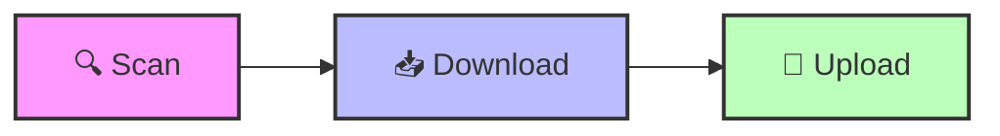

# Telegram Video Automation Kit

[](https://www.linkedin.com/in/yourname/)

**Navigation:** [README](README.md) | [Quick Start](QUICK_START.md) | [Scan & Resume](SCAN_RESUME.md)

---

## ⚡ Quick Start
```bash
./scan.sh      # 🔍 Map structure
./download.sh  # 📥 Fetch media
./upload.sh    # 🚀 Optimize & Post
```

---

## 🏗️ 3-Step Automated Workflow



The system is designed to be a fully automated bridge between web content and Telegram delivery.

### 🧩 Core Components
1. **🔍 Scan**: Initializes the mapping of content hierarchy and metadata via `scraper.py`.
2. **📥 Download**: Asynchronously fetches media assets into the local environment.
3. **🚀 Upload**: A heavy-duty pipeline that handles FFmpeg re-encoding, resolution scaling, and sequential delivery to Telegram channels.

---

## 🎬 Live Demo (Simulated Output)
```text
$ ./upload.sh --res 720 --intro
🚀 Starting high-performance upload pipeline...
📊 Profile: 720p HD | Intro: Enabled | Auto-Index: Active

[1/45] 🎞️ Processing: "001 - Introduction.mp4"
   ├─ ⚙️ Re-encoding to 720p... [OK]
   ├─ 🎨 Generating title card... [OK]
   └─ 📤 Uploading to Telegram (@YourChannel)... [100%]
✅ Success: Message ID #1052

[2/45] 🎞️ Processing: "002 - Advanced Logic.mp4"
   └─ 📤 Direct upload (already optimized)... [100%]
✅ Success: Message ID #1053

✨ Upload sequence finished.
📝 Successfully updated Table of Contents placeholders.
```

---

## 🧠 System Architecture & Capabilities
This project serves as a showcase for robust automation and media engineering:

- **Asynchronous Data Handling**: Optimized concurrency for high-speed scraping and media downloads.
- **Media Engineering API**: A dedicated wrapper for `FFmpeg` to handle dynamic video manipulation, scaling, and intro generation.
- **Stateful Manifest System**: A JSON-backed tracking system to ensure resume-ability and sequential integrity across large batches.
- **Telegram Bot Protocol**: Advanced implementation of the Telegram API for automated channel management and message indexing.
- **Modular Design**: Decoupled modules for scraping, media utilities, and delivery logic.

---

**Next Steps:** Check the [Quick Start Guide](QUICK_START.md) for detailed environment setup.
